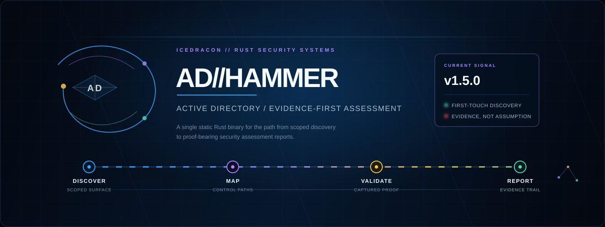

<p align="center">
  
</p>

<h1 align="center">ADhammer</h1>

<p align="center">
  <strong>Evidence-first Active Directory assessment in Rust.</strong><br />
  Discover the domain. Map Tier-0 paths. Validate only what can be backed by proof.
</p>

<p align="center">
  <a href="https://icedracon.github.io/adhammer/"><strong>WEBSITE</strong></a>
  &nbsp;·&nbsp;
  <a href="#quick-start"><strong>QUICK START</strong></a>
  &nbsp;·&nbsp;
  <a href="docs/VALIDATION.md"><strong>VALIDATION LEDGER</strong></a>
  &nbsp;·&nbsp;
  <a href="CHANGELOG.md"><strong>RELEASE NOTES</strong></a>
</p>

<p align="center">
  <a href="https://github.com/icedracon/adhammer/actions/workflows/ci.yml"></a>
  <a href="https://github.com/icedracon/adhammer/releases"></a>
  <a href="https://crates.io/crates/adhammer"></a>
  <a href="LICENSE"></a>
</p>

<br />

## From signal to evidence

ADhammer is an open-source CLI for authorized Active Directory security
assessments. It collects directory state, resolves control paths that end at
Tier-0, and keeps the status of every result explicit: **observed**,
**validated with proof**, or **validation owed**.

<table>
<tr>
<td width="25%" valign="top">

<sub>01 / SCOPED</sub><br />
<strong>Discover</strong><br />
<sub>Directory services and the exposure they reveal.</sub>

</td>
<td width="25%" valign="top">

<sub>02 / GRAPH</sub><br />
<strong>Map</strong><br />
<sub>Relationships and viable paths to Tier-0.</sub>

</td>
<td width="25%" valign="top">

<sub>03 / PROOF</sub><br />
<strong>Validate</strong><br />
<sub>Supported paths, with operator consent and captured evidence.</sub>

</td>
<td width="25%" valign="top">

<sub>04 / HANDOFF</sub><br />
<strong>Report</strong><br />
<sub>JSON, HTML, Markdown, and BloodHound CE export.</sub>

</td>
</tr>
</table>

<br />

## Truth before theatre

ADhammer does not treat a possible path as proof. That distinction is the
product: a report a defender can act on without guessing what was actually
demonstrated.

| Signal | Meaning |
|:--|:--|
| **Observed** | A condition was collected from the assessment scope. |
| **Validated** | A supported path produced recorded proof. |
| **Validation owed** | Code or a possible path exists, but proof is not on file. |

The [validation ledger](docs/VALIDATION.md) is authoritative for support and
readiness claims.

<br />

## v1.5.0 / first-touch signal

**Published 2026-09-04.** Version 1.5.0 adds a documented first-touch workflow
for authorized, in-scope environments: DNS SRV discovery, optional
fingerprinting of AD-facing HTTP(S) services, and anonymous SMB posture
collection where the target permits it. It also adds focused enumeration
surfaces, a coercion-family matrix, and hashcat-mode guidance on roast output.

The release is available through [GitHub Releases](https://github.com/icedracon/adhammer/releases/tag/v1.5.0)
and [crates.io](https://crates.io/crates/adhammer). Static release builds have
SHA-256 sidecars and GitHub OIDC Sigstore verification instructions. Exact
feature scope and validation status remain linked to the
[changelog](CHANGELOG.md) and [ledger](docs/VALIDATION.md).

<p align="center">
  <a href="https://github.com/icedracon/adhammer/releases/tag/v1.5.0"><strong>READ v1.5.0 NOTES →</strong></a>
</p>

<br />

## Quick start

```sh
cargo install --locked adhammer
adhammer --help
```

One binary. No Python runtime. No sidecar service. Prebuilt release binaries
are available for Linux, macOS, and Windows.

<details>
<summary><strong>Start an authorized assessment</strong></summary>
<br />

```sh
# Inspect the available assessment surface before using any live command.
adhammer --help

# Review documented syntax for the passive audit workflow.
adhammer scan --help
```

Use only systems you own or are explicitly authorized to test. Read the
[security policy](SECURITY.md), [validation ledger](docs/VALIDATION.md), and
[release notes](CHANGELOG.md) before an engagement.

</details>

<br />

## What ships

| Surface | What it gives you |
|:--|:--|
| **Directory assessment** | LDAP collection, AD CS context, delegation, trust, hygiene, and posture analysis. |
| **Attack-path graph** | Directional control edges and the cheapest viable routes to Tier-0. |
| **Evidence outputs** | JSON, HTML, Markdown, and BloodHound CE export with findings, paths, and proof kept connected. |
| **First-touch discovery** | Documented scoped DNS, AD web-surface, and anonymous posture workflows in v1.5.0. |
| **Rust ecosystem** | Published icedracon protocol crates that can be consumed independently. |

For exact CLI syntax, capability boundaries, and the complete vector inventory,
use [the command reference](VECTORS.md), `adhammer --help`, and the
[validation ledger](docs/VALIDATION.md).

<br />

## Security-signal boundary

<p align="center">
  
  
  
  
  
</p>

ADhammer is native to Active Directory assessment: discovery, directory
analysis, Tier-0 path mapping, supported validation, and report generation.
It creates structured evidence for approved downstream workflows; it is not
marketed as a SIEM, EDR, DLP platform, Sigma/YARA rule engine, general
web-application scanner, or Android / APK testing suite.

| Domain | ADhammer’s role |
|:--|:--|
| **SIEM / case workflow** | Machine-readable JSON evidence for downstream CI, SIEM, and scoring pipelines — not a built-in vendor connector. |
| **EDR / DLP** | External controls. Authorized assessments may create observable protocol activity; ADhammer ships no evasion or endpoint-agent capability. |
| **Sigma / YARA** | Not shipped. Detection content belongs in the team’s approved detection-engineering workflow. |
| **Web / APK pentest** | Separate disciplines. ADhammer’s documented web capability targets AD-facing surfaces, not general application or mobile testing. |

<p align="center">
  <code>ADhammer assessment</code> &nbsp;→&nbsp; <code>evidence-rich JSON report</code> &nbsp;→&nbsp; <code>your approved detection / case workflow</code>
</p>

<br />

## Built for people who need proof

<table>
<tr>
<td width="33%" valign="top">

<strong>Assessors</strong><br />
<sub>One static binary for scoped AD reconnaissance, analysis, and authorized validation.</sub>

</td>
<td width="33%" valign="top">

<strong>Defenders</strong><br />
<sub>Evidence-rich findings that show what was observed, proven, or still needs validation.</sub>

</td>
<td width="33%" valign="top">

<strong>Rust builders</strong><br />
<sub>Reusable icedracon protocol crates without adopting the full application.</sub>

</td>
</tr>
</table>

<br />

## The icedracon stack

ADhammer is the application layer on top of published, standalone Rust crates
for Microsoft security protocols. Use the binary for an assessment, or adopt a
single crate when you need a lower-level building block.

| Layer | Examples |
|:--|:--|
| **Transport** | [`dcerpc`](https://crates.io/crates/dcerpc) · [`smb2-client`](https://crates.io/crates/smb2-client) · [`ms-ndr`](https://crates.io/crates/ms-ndr) |
| **Directory / graph** | [`adhammer-collector`](https://crates.io/crates/adhammer-collector) · [`adhammer-graph`](https://crates.io/crates/adhammer-graph) · [`bloodhound-export`](https://crates.io/crates/bloodhound-export) |
| **Auth / crypto** | [`ntlmssp`](https://crates.io/crates/ntlmssp) · [`ms-pac`](https://crates.io/crates/ms-pac) · [`dpapi-ng`](https://crates.io/crates/dpapi-ng) |
| **AD CS / RPC** | [`ms-icpr`](https://crates.io/crates/ms-icpr) · [`ms-crtd`](https://crates.io/crates/ms-crtd) · [`ms-drsr`](https://crates.io/crates/ms-drsr) |

Explore the wider ecosystem on [crates.io/users/zevs](https://crates.io/users/zevs).

<br />

## Reference shelf

| Need | Go here |
|:--|:--|
| Release-specific change log | [CHANGELOG.md](CHANGELOG.md) |
| Support and validation state | [docs/VALIDATION.md](docs/VALIDATION.md) |
| Benchmark methodology and raw data | [docs/BENCHMARKS.md](docs/BENCHMARKS.md) |
| Security policy and reporting | [SECURITY.md](SECURITY.md) |
| Contributing guidance | [CONTRIBUTING.md](CONTRIBUTING.md) |

<br />

## Authorized use

> [!CAUTION]
> ADhammer implements security-assessment and validation capabilities that can
> affect production systems. Use it only against systems you own or are
> explicitly authorized to test.

<p align="center">
  <a href="https://github.com/icedracon/adhammer/stargazers">STAR THE REPO</a>
  &nbsp;·&nbsp;
  <a href="https://crates.io/crates/adhammer">INSTALL FROM CRATES.IO</a>
  &nbsp;·&nbsp;
  <a href="https://icedracon.github.io/adhammer/">OPEN THE SITE</a>
</p>

<p align="center">
  <sub>MIT © <a href="https://github.com/icedracon">icedracon</a></sub>
</p>
