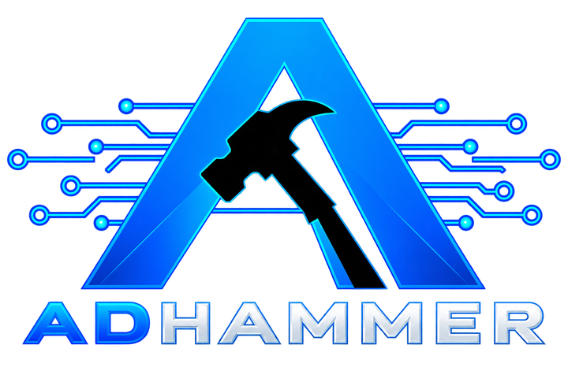
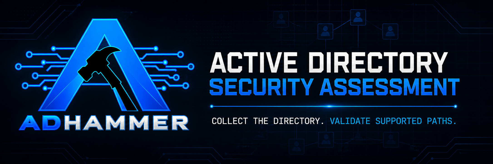
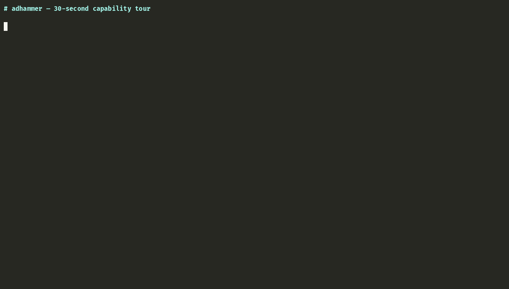
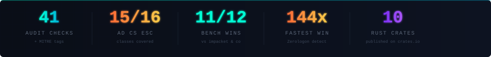
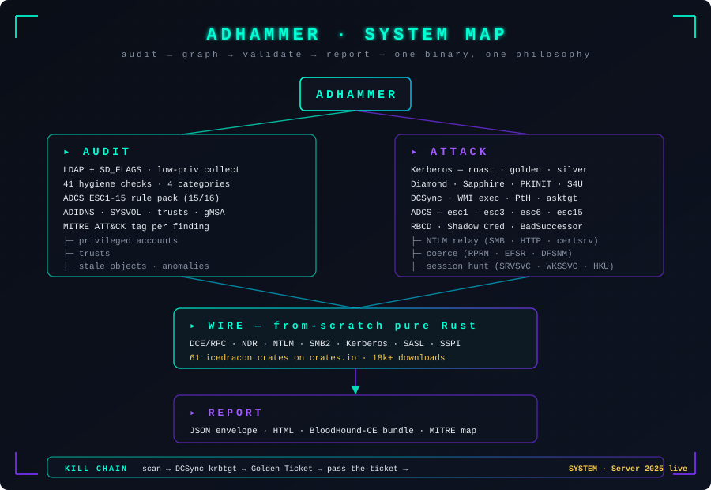
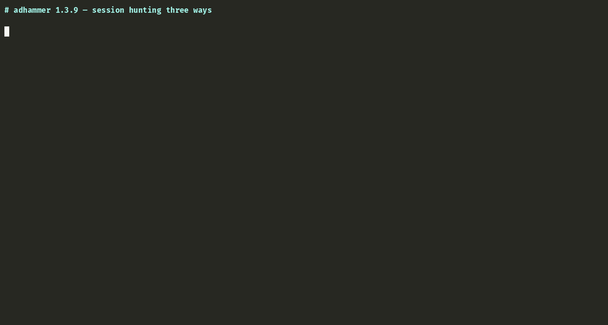
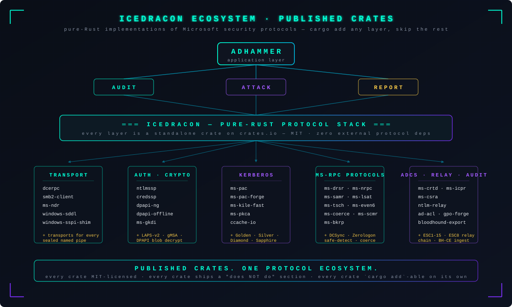

<p align="center">
  
</p>

<p align="center">
  
</p>

<h3 align="center">Open-source Rust · Active Directory pentest tool</h3>

<p align="center"><b>Collect the directory. Validate supported paths.</b></p>

<p align="center"><sub>One static binary. Evidence-first reporting. Published Rust protocol crates.</sub></p>

<p align="center">
  <a href="https://icedracon.github.io/adhammer/"><b>&nbsp;SITE&nbsp;</b></a>
  &nbsp;·&nbsp;
  <a href="https://crates.io/crates/adhammer"><b>&nbsp;INSTALL&nbsp;</b></a>
  &nbsp;·&nbsp;
  <a href="#-try-it-in-30-seconds"><b>&nbsp;DEMO&nbsp;</b></a>
  &nbsp;·&nbsp;
  <a href="docs/BENCHMARKS.md"><b>&nbsp;BENCHMARKS&nbsp;</b></a>
</p>

<p align="center">
  <a href="https://github.com/icedracon/adhammer/actions/workflows/ci.yml"></a>
  <a href="https://github.com/icedracon/adhammer/releases"></a>
  <a href="https://crates.io/crates/adhammer"></a>
  <a href="https://github.com/icedracon/adhammer/stargazers"></a>
  <a href="LICENSE"></a>
  <a href="https://icedracon.github.io/adhammer/"></a>
</p>

<p align="center">
  <sub><b>validation ledger in <code>docs/VALIDATION.md</code></b> · <b>release notes in <code>CHANGELOG.md</code></b> · MIT</sub>
</p>

<br/>

## The idea

> **Evidence over assumption.** Collect the directory, trace the path, and validate supported findings with captured proof.

ADhammer collects the domain, graphs every control path that ends at Tier-0, then *proves* the interesting ones with the same protocol code the attacker would use. One continuous session from LDAP recon to a signed AS-REP on disk. Findings you can hand to a customer with the exact byte sequence that produced them.

<br/>

<p align="center">
  
</p>

<p align="center">
  <sub>The reference DA kill-chain demo, live against a hardened Server 2025 DC — under a minute on the lab environment.</sub>
</p>

<br/>

<p align="center">
  
</p>

<p align="center">
  <sub>Or the 30-second capability tour — audit, posture, Kerberoast, ADCS rule pack.</sub>
</p>

<br/>

## 🎯 Detect ≠ Validate

Most AD security tools stop at *"potential attack path detected."*

ADhammer keeps going.

```text
Finding detected
      ↓
Attack path constructed
      ↓
Validation requested
      ↓
Live PoC executed
      ↓
Proof obtained
      ↓
Report generated
```

The difference matters:

| Not | But |
|:---:|:---:|
| *"potential path"* | ***"supported validation captured proof"*** |

Every finding in the report is either an audit observation, a supported validation with proof, or a path that still needs operator context. Defenders can see what was observed, what was proven, and what remains validation owed.

<br/>

## Release Truth

The current workspace version is **1.4.5**.

Public claims for ADhammer should follow three rules:

- **Release-specific changes live in [CHANGELOG.md](CHANGELOG.md).**
- **Validation status lives in [docs/VALIDATION.md](docs/VALIDATION.md).**
- **No public copy should claim more than the validation ledger supports.**

That keeps the README useful across release lines without turning the first screen into a moving archive.

<br/>

## 👥 Who is this for?

<table>
<tr>
<td width="33%" valign="top">

**🔴 Red team operators**

One binary, no Python runtime, no sidecar services. Works from Kali or straight off a Windows jump box. Supported validation paths are exercised in an authorized lab and tracked in the validation ledger instead of being overstated in marketing copy.

</td>
<td width="33%" valign="top">

**🛡️ AD auditors / defenders**

50+ hygiene checks across four categories, MITRE ATT&CK-tagged, low-priv collection via `SD_FLAGS`. Reports as JSON, HTML, or a BloodHound-CE ingest bundle. Supported findings have matching PoCs; unsupported ones stay labeled potential instead of being overstated.

</td>
<td width="33%" valign="top">

**🦀 Rust developers**

Published icedracon protocol crates on crates.io, each `cargo add`-able. Compose your own DCE/RPC stack, forge PACs, decrypt LAPS blobs, or emit BloodHound JSON — pick the layer that fits, skip the rest. See the **[ecosystem section](#-built-on-a-from-scratch-rust-ecosystem)**.

</td>
</tr>
</table>

<br/>

<p align="center">
  <a href="https://github.com/icedracon/adhammer/stargazers">⭐ Star the repo</a> &nbsp;·&nbsp;
  <a href="https://crates.io/crates/adhammer">📦 <code>cargo install adhammer</code></a> &nbsp;·&nbsp;
  <a href="https://dev.to/pumadracon/i-built-a-full-active-directory-pentest-audit-tool-in-rust-on-a-protocol-stack-i-wrote-from-fl5">📖 Read the write-up</a>
</p>

<br/>

## 🚀 Try it in 30 seconds

```sh
cargo install --locked adhammer

adhammer scan  --url ldaps://dc.corp.local:636 \
               --user 'CORP\svc' --password ... \
               --insecure --bloodhound out.zip
```

Fast per-operation timings (see [BENCHMARKS.md](docs/BENCHMARKS.md) for the recorded matrix), JSON + HTML report, BloodHound-compatible graph bundle — from a low-privileged domain user account. See the [full command list](#usage) below or grab prebuilt binaries (musl / glibc / macOS / Windows) from **[Releases](https://github.com/icedracon/adhammer/releases)**.

<br/>

> [!CAUTION]
> **Authorized use only.** ADhammer implements working offensive techniques — DCSync, golden / silver / diamond tickets, pass-the-ticket, NTLM relay, ADCS abuse, remote code execution. Use only against systems you own or are explicitly authorized to test. See [SECURITY.md](SECURITY.md).

<br/>

<p align="center">
  
</p>

<br/>

<p align="center">
  
</p>

<br/>


<br/>


<br/>

**One product philosophy: detect the path, then prove it.**

```text
                     ADHAMMER
                        │
                        ▼
    ┌─────────────────────────────────────────┐
    │                 AUDIT                   │
    │   LDAP + SD_FLAGS  →  Snapshot          │
    │   50+ hygiene checks + 15/16 ADCS ESC   │
    └─────────────────────┬───────────────────┘
                          ▼
    ┌─────────────────────────────────────────┐
    │                 GRAPH                   │
    │   petgraph control-path graph           │
    │   cheapest chain to Tier-0 (Dijkstra)   │
    └─────────────────────┬───────────────────┘
                          ▼
    ┌─────────────────────────────────────────┐
    │              VALIDATE                   │
    │   Live PoC per finding — real hash,     │
    │   real cert, real replicated secret     │
    └─────────────────────┬───────────────────┘
                          ▼
    ┌─────────────────────────────────────────┐
    │               REPORT                    │
    │   JSON · HTML · BloodHound-CE bundle    │
    │   MITRE ATT&CK per finding + evidence   │
    └─────────────────────────────────────────┘
```

Two commands drive the whole flow. Everything else is a subcommand.

### 1 &mdash; `adhammer scan` &nbsp;·&nbsp; audit a domain

Collects a domain over LDAP as a **low-privileged user** (via the `SD_FLAGS` control), builds a control-path graph in-process, and runs the check pack across four categories — privileged accounts, trusts, stale objects, anomalies — plus **15 of the 16 AD CS ESC classes**, ADIDNS exposure, and SYSVOL / GPP. Every finding is scored, MITRE-tagged, and exportable in a BloodHound-compatible JSON bundle.

### 2 &mdash; `adhammer auto` &nbsp;·&nbsp; validate supported findings with a live PoC

A report shouldn't say a path *might* be exploitable when the tool can prove it. `auto` walks each finding, asks "*validate this one?*" — on yes runs the matching supported tradecraft, marks the finding **validated only when real proof is present** (an actual `$krb5tgs$` hash, a replicated `krbtgt` secret, an `ISSUED` cert), and leaves unsupported findings explicitly marked as potential. Everything lands in a Markdown assessment report with the exact command + evidence per PoC.

<br/>

<p align="center">
  
</p>

<p align="center">
  <sub><i>Guided <code>auto</code> output — severity-coded findings, each optionally confirmed with a live PoC.</i></sub>
</p>

<br/>


<br/>


<br/>

## ⚡ Performance

Every operation on a warm cache against a fully-patched **Windows Server 2025** domain controller, cold-timed at the command boundary. Compiled Rust binary — cold-start under a second, most operations under **100 ms**.

| Operation | Median |
|:---|---:|
| Zerologon safe-detect | **54 ms** |
| RBCD write (`msDS-AllowedToActOnBehalfOfOtherIdentity`) | **49 ms** |
| BadSuccessor (Server 2025 dMSA succession) | **48 ms** |
| LDAP query (name → SID) | **59 ms** |
| SAMR user enumeration | **63 ms** |
| AD CS enterprise CA enumeration | **67 ms** |
| DCSync `krbtgt` secret | **73 ms** |
| RRP secretsdump (SAM + SECURITY + SYSTEM) | **74 ms** |
| Kerberoast one SPN | **79 ms** |
| AS-REP roast one account | **80 ms** |
| Full LDAP audit + control-path graph (500-object domain) | **88 ms** |
| AD CS ESC1 enrollment end-to-end (submit → issued PEM) | **315 ms** |

Reproduce in one command — driver ([`bench/run_bench.sh`](bench/run_bench.sh)) · renderer ([`bench/render_results.py`](bench/render_results.py)) · TSV output ([`bench/results.tsv`](bench/results.tsv)) · methodology ([`docs/BENCHMARKS.md`](docs/BENCHMARKS.md)).

<br/>


<br/>

## 📥 Install

<table>
<tr>
<td width="50%">

**From crates.io** — always latest:

```sh
cargo install --locked adhammer
```

> **Windows / Defender note.** Windows Defender will heuristically quarantine
> the compiled `adhammer.exe` during `cargo install`, failing with
> `Operation did not complete successfully because the file contains a virus
> or potentially unwanted software. (os error 225)` — the compile itself is
> fine; Defender flags the final copy from the install temp dir to
> `~/.cargo/bin/`. To install cleanly, add exclusions once (elevated PowerShell):
>
> ```powershell
> Add-MpPreference -ExclusionPath "$env:USERPROFILE\.cargo\bin"
> Add-MpPreference -ExclusionPath "$env:USERPROFILE\.cargo\registry"
> Add-MpPreference -ExclusionProcess "adhammer.exe"
> cargo install --locked adhammer
> ```
>
> Or grab the signed release binary from the [Releases](https://github.com/icedracon/adhammer/releases) page instead — no exclusion needed.

**As a library** — every module importable:

```sh
cargo add adhammer-sdk
```

</td>
<td width="50%">

**Prebuilt binaries** per release:

- musl (static, no glibc)
- glibc (Linux)
- macOS (arm64 + x64)
- Windows (x64)

Grab the latest from **[Releases →](https://github.com/icedracon/adhammer/releases)**

</td>
</tr>
</table>

Requires **Rust 1.87+** to build from source. Tested on Kali, Ubuntu, Debian, macOS, and native Windows.

<br/>


<br/>

## 🎯 Usage

Run `adhammer` with **no arguments** for the **guided interactive menu** — asks for user → password (or NT hash) → domain → DC, saves the session, walks every action with prompts. For golden / silver / pass-the-ticket it auto-fetches the krbtgt / service AES256 key (via DCSync) and the domain SID (via LSAT). Add `--no-save` to keep credentials off disk.

<p align="center">
  
</p>

<br/>

### Session hunting — three complementary primitives

`enum sessions` (SRVSVC), `enum wkssvc` (WKSSVC), and `enum hku` (HKU registry walk) each answer the *who is on this box* question from a different angle — different auth requirements, different result granularity. Dedup + machine-account filtering are on by default (`--include-machine` shows the count marker for what was hidden).

<p align="center">
  
</p>

<p align="center">
  <sub>SRVSVC + WKSSVC + HKU registry — one target, three angles. <code>--json</code> pipes cleanly into <code>jq</code>.</sub>
</p>

<br/>

**Power-user subcommands:**

```
scan                                        passive audit -> JSON/HTML (+ --sysvol, --bloodhound out.zip)
auto                                         guided: scan -> confirm each weakness -> validate + PoC report
enum   {samr, lsa, net, dns, adcs, esc, posture, sessions}
                                            RPC / net / ADIDNS / AD-CS / ESC-registry / DC-posture / SRVSVC
attack {roast, spray, abuse, coerce, rbcd, constrained, unconstrained, dcsync, exec, atexec, wmiexec,
        secretsdump, gmsa, laps, esc1, esc4, icpr-esc1, golden, silver, pth, asktgt, winrm, capture,
        poison, relay, zerologon, shadowcred, dcshadow, badsuccessor}
```

<details>
<summary><b>💡 Example commands</b></summary>
<br/>

```sh
# Audit a domain (low-priv creds are enough), export a BloodHound bundle:
adhammer scan --url ldaps://dc.corp.local:636 --user 'CORP\svc' --password ... --insecure --bloodhound out.zip

# ADIDNS + AD CS recon:
adhammer enum dns  --url ldaps://dc:636 --user 'CORP\svc' --password ... --insecure
adhammer enum adcs --url ldaps://dc:636 --user 'CORP\svc' --password ... --insecure

# DCSync the krbtgt key, forge a golden ticket, pass-the-ticket to SYSTEM:
adhammer attack dcsync --host dc --domain CORP --user Administrator --password ... --target krbtgt
adhammer attack pth    --host dc --realm CORP.LOCAL --krbtgt-aes256 <64-hex> --domain-sid S-1-5-21-... \
                       --spn cifs/dc.corp.local --command whoami

# AD CS ESC1 / ESC3 / ESC6 / ESC15 enrollment via MS-ICPR:
adhammer attack icpr-esc1 --ca CORP-CA --template User --target-upn administrator@corp.local \
                        --host dc --domain CORP --user 'CORP\svc' --password ... \
                        --esc esc6 --san-upn administrator@corp.local

# Server 2025 dMSA succession (BadSuccessor):
adhammer attack badsuccessor --dmsa-name pwn --target <victim>
```

</details>

<br/>


<br/>


<br/>

## 📋 Coverage

### Audit checks — 4 categories, 15/16 AD CS ESC classes

| Category | Coverage |
|:---------|:---------|
| **Privileged accounts** | AS-REP / Kerberoast exposure · unconstrained delegation · DCSync control paths (graph) · sensitive-group membership · gMSA read ACL · SID history · RBCD · LAPS coverage · `PASSWD_NOTREQD` |
| **Trusts** | SID filtering · selective auth · cross-forest TGT delegation · RC4 downgrade · transitivity |
| **Stale objects** | Inactive users / computers · old passwords · EOL OS · duplicate SPNs · stale machine passwords |
| **Anomalies** | `MachineAccountQuota` · krbtgt age · RC4 Kerberos · reversible encryption · BadSuccessor (dMSA) · password policy · anonymous LDAP · Pre-Windows 2000 · Guest · GPP `cpassword` (MS14-025) · LM / NTLMv1 · LDAP / SMB signing |
| **AD CS (15/16 ESC)** | Passive: ESC1-5, 9, 13-15 / EKUwu (CVE-2024-49019) · Active: ESC1, ESC3, ESC6, ESC8, ESC15 · Registry: ESC6-7, 10-11, 16 · Only ESC12 (hardware token) out of scope |
| **ADIDNS** | Zone + record enumeration with wildcard (mitm6 / WPAD) exposure detection |

Every finding carries a **MITRE ATT&CK** technique (T1558.003, T1003.006, T1649, T1484, …).

<br/>

<details>
<summary><b>🔍 Recon / export</b></summary>
<br/>

- LDAP audit (paged, `SD_FLAGS`-scoped) → JSON / HTML report
- BloodHound-CE compatible bundle export
- SAMR / LSAT / SRVSVC / MS-RRP enumeration
- ADIDNS zone dump + wildcard record detection
- AD CS enterprise CA discovery + ESC8 web-enrollment probe
- DC posture: LDAP signing / channel binding / Spooler / RemoteRegistry

</details>

<details>
<summary><b>🔑 Kerberos</b></summary>
<br/>

- AS-REP roast + Kerberoast (RC4 + AES256)
- Ask-TGT (`--asktgt`) + password spray
- Pass-the-ticket over sealed SMB2 + AP-REQ
- Golden ticket (RC4 + AES256, PAC KB5020805-compliant)
- Silver ticket (per-service)
- **Diamond ticket** *(library only, via [`ms-pac-forge`](https://crates.io/crates/ms-pac-forge) — no CLI subcommand yet)* — identity-swap on a real TGT envelope (detection evasion)
- FAST armor (RFC 6113)
- PKINIT + Shadow Credentials

</details>

<details>
<summary><b>🎭 Delegation abuse</b></summary>
<br/>

- Unconstrained delegation
- Constrained delegation (S4U2Self + S4U2Proxy)
- RBCD write + exploit chain (`msDS-AllowedToActOnBehalfOfOtherIdentity`)

</details>

<details>
<summary><b>📜 AD CS enrollment — full ESC pack</b></summary>
<br/>

- **ESC1** — enrollee-supplied UPN SAN in CSR
- **ESC3** — CMC EnrollOnBehalfOf via caller-supplied Enrollment Agent cert
- **ESC6** — SAN as CA `pctbAttribs` request-attribute
- **ESC8** — Web-enrollment relay chain
- **ESC15** — EKUwu / CVE-2024-49019 via Microsoft Application Policies extension
- **ESC4** — write template attributes to make a template ESC1-vulnerable

</details>

<details>
<summary><b>🗝️ Secrets extraction</b></summary>
<br/>

- DCSync (DRSUAPI, single-account or full domain)
- RRP secretsdump (local SAM + SECURITY + SYSTEM offline decrypt)
- LSASS minidump credential hunt (offline)
- LAPS v1 (`ms-Mcs-AdmPwd`) + LAPS v2 (`msLAPS-EncryptedPassword` via GKDI)
- gMSA `msDS-ManagedPassword` decrypt

</details>

<details>
<summary><b>🕸️ Coercion + relay + lateral movement</b></summary>
<br/>

- Coerce (RPRN / EFSR / DFSNM / FSRVP)
- NTLM relay → LDAP / SMB / AD CS Web (ESC8)
- LLMNR + NBT-NS poison → NetNTLMv2 capture
- Remote exec: SVCCTL · TSCH (atexec) · WMI (DCOM) · WinRM
- Zerologon **safe-detect** by default (`attack zerologon` runs read-only detection); a destructive `--exploit` path exists and requires explicit runtime confirmation
- DCShadow (rights enumeration + prep/cleanup shipped; DRSUAPI push path present, live validation owed)
- Server 2025 **BadSuccessor** (dMSA)

</details>

<br/>


<br/>

## 🧱 Built on a from-scratch Rust ecosystem

<p align="center">
  
</p>

<br/>

ADhammer is one binary on top of **published standalone icedracon crates**, each doing one job well and each `cargo add`-able on its own. Every crate ships an explicit *"what this does NOT do"* section, is MIT-licensed, and works standalone. Exact crate counts and download totals change over time; the important constant is that the protocol stack is reusable outside the binary.

**Two brands, one project:**

- **ADhammer** — the application. AD security assessment + live attack-path validation.
- **icedracon** — the ecosystem. Pure-Rust implementations of Microsoft security protocols. Adopt one crate (`cargo add dcerpc`) without adopting the whole toolkit.

<details open>
<summary><b>The load-bearing crates</b></summary>
<br/>

| Layer | Crates |
|:---|:---|
| **Transport** | [`dcerpc`](https://crates.io/crates/dcerpc) · [`smb2-client`](https://crates.io/crates/smb2-client) · [`ms-ndr`](https://crates.io/crates/ms-ndr) |
| **Auth / crypto** | [`ntlmssp`](https://crates.io/crates/ntlmssp) · [`credssp`](https://crates.io/crates/credssp) · [`dpapi-ng`](https://crates.io/crates/dpapi-ng) · [`dpapi-offline`](https://crates.io/crates/dpapi-offline) · [`ms-gkdi`](https://crates.io/crates/ms-gkdi) |
| **Kerberos** | [`ms-pac`](https://crates.io/crates/ms-pac) · [`ms-pac-forge`](https://crates.io/crates/ms-pac-forge) · [`ms-kile-fast`](https://crates.io/crates/ms-kile-fast) · [`ms-pkca`](https://crates.io/crates/ms-pkca) · [`ccache-io`](https://crates.io/crates/ccache-io) *(new — MIT ccache + .kirbi codec)* |
| **DCE/RPC protocols** | [`ms-drsr`](https://crates.io/crates/ms-drsr) · [`ms-nrpc`](https://crates.io/crates/ms-nrpc) · [`ms-samr`](https://crates.io/crates/ms-samr) · [`ms-lsat`](https://crates.io/crates/ms-lsat) · [`ms-tsch`](https://crates.io/crates/ms-tsch) · [`ms-even6`](https://crates.io/crates/ms-even6) · [`ms-tds`](https://crates.io/crates/ms-tds) · [`ms-coerce`](https://crates.io/crates/ms-coerce) · [`ms-scmr`](https://crates.io/crates/ms-scmr) *(new)* · [`ms-bkrp`](https://crates.io/crates/ms-bkrp) *(new)* |
| **AD CS** | [`ms-crtd`](https://crates.io/crates/ms-crtd) · [`ms-icpr`](https://crates.io/crates/ms-icpr) · [`ms-csra`](https://crates.io/crates/ms-csra) |
| **NTDS / secrets** | [`ese-parser`](https://crates.io/crates/ese-parser) · [`ntds-parse`](https://crates.io/crates/ntds-parse) · [`lsass-parse`](https://crates.io/crates/lsass-parse) |
| **AD / GPO / audit** | [`ad-acl`](https://crates.io/crates/ad-acl) · [`msldap-ext`](https://crates.io/crates/msldap-ext) · [`gpo`](https://crates.io/crates/gpo) · [`gpo-forge`](https://crates.io/crates/gpo-forge) · [`preg`](https://crates.io/crates/preg) · [`ms-dnsp`](https://crates.io/crates/ms-dnsp) · [`ms-fve`](https://crates.io/crates/ms-fve) · [`ms-rodc`](https://crates.io/crates/ms-rodc) |
| **Relay / lateral** | [`ntlm-relay`](https://crates.io/crates/ntlm-relay) · [`llmnr-poison`](https://crates.io/crates/llmnr-poison) · [`winrm-pentest`](https://crates.io/crates/winrm-pentest) |
| **Windows-local (host-side)** | [`windows-sddl`](https://crates.io/crates/windows-sddl) · [`windows-lsa`](https://crates.io/crates/windows-lsa) · [`windows-scm`](https://crates.io/crates/windows-scm) · [`windows-token`](https://crates.io/crates/windows-token) · [`windows-wmi-com`](https://crates.io/crates/windows-wmi-com) · [`windows-sspi-shim`](https://crates.io/crates/windows-sspi-shim) · [`windows-eventlog-native`](https://crates.io/crates/windows-eventlog-native) |
| **BloodHound export** | [`bloodhound-export`](https://crates.io/crates/bloodhound-export) |

</details>

Full crate list on **[crates.io/users/zevs](https://crates.io/users/zevs)**.

<br/>


<br/>

## 📚 Deep dives

> **Featured on dev.to** — a detailed write-up of how the from-scratch Rust protocol stack came together.

- **Write-up** — *[I built a full Active Directory pentest + audit tool in Rust on a from-scratch protocol stack](https://dev.to/pumadracon/i-built-a-full-active-directory-pentest-audit-tool-in-rust-on-a-protocol-stack-i-wrote-from-fl5)* (dev.to)
- **Changelog** — per-release notes live in **[GitHub Releases](https://github.com/icedracon/adhammer/releases)** and [CHANGELOG.md](CHANGELOG.md)
- **Benchmarks** — full methodology + raw log in [`docs/BENCHMARKS.md`](docs/BENCHMARKS.md)
- **Ecosystem tour** — [`crates.io/users/zevs`](https://crates.io/users/zevs)

<br/>

## 🧪 Test

CI runs the full workspace test suite on every push (100+ unit + integration tests across the CLI and 11 sub-crates). Green means ship. Reproduce locally:

```sh
cargo test --workspace
```

<br/>

## 🤝 Contributing

PRs welcome — especially for new AD CS ESC variants, additional coerce endpoints, and cross-forest trust auditing. Open an issue first for anything larger than a bug fix.

## ☕ Support

ADhammer is MIT-licensed and independently developed. Every contribution funds another wire primitive, another live-validation session against a real DC, another release.

**USDT (TRC20 / Tron)** — instant, low-fee, no gatekeepers:

<table>
<tr>
<td width="200"></td>
<td>

```
TDKrs1rjiUaB1JnvWRDaoxM7o1jjVuDTDW
```

Scan from any wallet, or copy-paste the address. Tron network, minimum ~1 USDT to cover network fee.

</td>
</tr>
</table>

<sub>GitHub Sponsors + Ko-fi channels coming as Stripe onboarding clears. Until then, the address above is the fastest path.</sub>

## 🛡️ Security

Vulnerabilities: report privately per [SECURITY.md](SECURITY.md). ADhammer contains working offensive techniques — use only against systems you own or are explicitly authorized to test.

## 📄 License

MIT © the [`icedracon`](https://github.com/icedracon) project.

<br/>

<p align="center">
  <sub>Built by <a href="https://github.com/zevs">@zevs</a> · <a href="https://crates.io/users/zevs">crates.io/users/zevs</a></sub>
</p>
