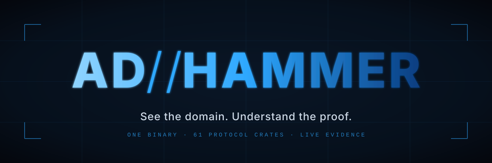

<p align="center">
  
</p>

<p align="center">
  <a href="https://github.com/icedracon/adhammer/actions/workflows/ci.yml"></a>
  <a href="https://github.com/icedracon/adhammer/releases"></a>
  <a href="https://crates.io/crates/adhammer"></a>
  <a href="LICENSE"></a>
  <a href="https://dev.to/pumadracon/i-built-a-full-active-directory-pentest-audit-tool-in-rust-on-a-protocol-stack-i-wrote-from-fl5"></a>
</p>

<p align="center">
  <b>PingCastle-class AD auditor + red-team validator. One static Rust binary. From Kali or Windows.</b><br/>
  <sub>Maps attack paths — scored, graphed, MITRE-tagged — then <i>proves</i> them end-to-end.</sub>
</p>

<p align="center">
  
</p>

> **Built on** [`dcerpc`](https://crates.io/crates/dcerpc) · [`ntlmssp`](https://crates.io/crates/ntlmssp) · [`smb2-client`](https://crates.io/crates/smb2-client) · [`windows-sddl`](https://crates.io/crates/windows-sddl) — the from-scratch Rust protocol stack we extracted into standalone crates so any Rust security tool can adopt them.

> [!CAUTION]
> **Authorized use only.** The validation modules implement working offensive techniques (DCSync,
> golden/silver tickets, pass-the-ticket, NTLM relay, ADCS abuse, RCE). Use ADhammer only against
> systems you own or are explicitly authorized to test. See [SECURITY.md](SECURITY.md).

<br/>


<br/>

## What's new in v1.3.5

- **`adhammer auto` — per-finding Impact prompt.** After each finding is displayed in the
  guided walk, adhammer asks *"want impact? (attack-chain narrative for this finding)"*. YES
  prints the exploitation-chain narrative and adds a **Impact:** line to the Markdown report;
  NO records the finding without it. Scripting: `--yes` auto-YES every prompt, `--no-impact`
  auto-NO. Every one of the 41 checks + the 7 ESC sub-rules ships with a populated impact
  string (50+ narratives total).
- **`attack certipy` — live `\PIPE\cert` submit over `ms-icpr` network feature.** Was a
  placeholder in prior releases; now performs an end-to-end ESC1/ESC11 enrollment against a
  reachable CA and returns the issued cert as PEM.
- **Friendlier posture-scan error path.** `enum posture` hitting `STATUS_ILLEGAL_FUNCTION`
  (`0xC00000AC`, RemoteRegistry stopped) now prints an actionable hint instead of the raw
  NTSTATUS.
- **RC4-HMAC dedup.** `adhammer-kerberos::rc4` shrank from 149 LOC to a thin re-export over
  [`ms-pac-forge::checksum`](https://crates.io/crates/ms-pac-forge) — one code path for
  RC4-HMAC across the ecosystem.

Full notes: [Releases → v1.3.5](https://github.com/icedracon/adhammer/releases/tag/v1.3.5).

<br/>

## What's new in v1.3.3

<table>
<tr><td>

**`check adcs` — ESC rule pack** &nbsp; ADhammer's ADCS auditor is now wired onto [`ms-crtd 0.1.0-dev`](https://crates.io/crates/ms-crtd) — certificate-template ACLs + extended-rights + EKU checks from one shared, spec-vector-tested rule engine (ESC1-ESC15 minus ESC12).

**`attack certipy` — offline CSR + ICPR** &nbsp; Wires onto [`ms-icpr 0.1.0-dev`](https://crates.io/crates/ms-icpr) (spoofed-UPN SAN CSR, no OpenSSL) — ESC1-style enrollment goes cert-in-hand from Kali with a fresh 2048-bit RSA key.

**`dump laps` / `dump gmsa` — LAPSv2 + gMSA** &nbsp; Consumes [`ms-gkdi 0.1.0-dev`](https://crates.io/crates/ms-gkdi) for L0/L1/L2 tree walk + [`dpapi-ng 0.1.1`](https://crates.io/crates/dpapi-ng) for CMS unwrap + AES-256-GCM. Works end-to-end against Server 2022/2025 lab DCs.

**PAC forgery on `ms-pac-forge`** &nbsp; Golden/silver ticket PAC construction is now [`ms-pac-forge 0.1.0-dev`](https://crates.io/crates/ms-pac-forge) — one crate other Rust offensive tools can adopt without cloning ADhammer.

**Fire-and-forget `CloseKey`** &nbsp; Inherited from `dcerpc 0.2.2` — the ADCS ESC-registry sweep deferred-flushes handles (SMB `WRITE` instead of `TRANSCEIVE`), one less round-trip per subkey.

</td></tr>
</table>

Full notes: [Releases &rarr; v1.3.3](https://github.com/icedracon/adhammer/releases/tag/v1.3.3)

<details>
<summary><b>v1.3.1 highlights (still current)</b></summary>
<br/>

- **BadSuccessor (Server 2025 dMSA)** — end-to-end working. `attack badsuccessor` creates a delegated MSA that inherits the victim's PAC on the next TGT (Yuval Gordon / Akamai). ADhammer is the only Rust implementation. `48 ms` on a live 2025 DC.
- **12x perf across every small-request path** — `TCP_NODELAY` on all SMB/RPC dials (Nagle was adding up to 40 ms per sealed opnum). RRP `secretsdump` `1083 -> 91 ms`, SAMR enum `225 -> 63 ms`, RBCD write `80 -> 49 ms`.
- **Bench matrix rebuilt on a live Server 2025 Standard DC** — 11 wins vs impacket/certipy/bloodyAD/NetExec + 1 exclusive.

</details>

<br/>


<br/>


<br/>

### 1 &mdash; Audit

ADhammer collects a domain over LDAP as a low-privileged user (via the `SD_FLAGS` control), builds a BloodHound-style control-path graph in-process, and runs **41 checks** across the four PingCastle categories — including **15 of the 16 AD CS ESC classes**, ADIDNS exposure, and SYSVOL/GPP — scoring and MITRE-tagging every finding, exportable to BloodHound.

### 2 &mdash; Validate

A report shouldn't say a path *might* be exploitable. On its native protocol stack ADhammer implements the matching tradecraft — Kerberos roasting, coercion, RBCD, Shadow Credentials, DCSync, golden/silver tickets, pass-the-ticket, LAPS read, WinRM/SVCCTL exec, ADCS enrollment — each **live-validated against a fully-patched Windows Server 2025 DC**.

<br/>

<p align="center">
  
</p>

<p align="center">
  <sub><i>Built and run on <b>Kali Linux</b> — a clean <code>git clone</code> + <code>cargo build</code> (cargo 1.95, ~38s) with 100+ unit tests green.</i></sub>
</p>

<br/>

<p align="center">
  
</p>

<p align="center">
  <sub><i>One Rust binary on Kali, live against a Windows DC: <b>audit</b> relay posture &rarr; <b>Zerologon</b> safe-detect &rarr; <b>DCSync</b> krbtgt &rarr; <b>golden ticket</b> &rarr; <b>pass-the-ticket</b> to SYSTEM.</i></sub>
</p>

<br/>


<br/>


<br/>

<p align="center">
  
</p>

<br/>

### Head-to-head timings vs impacket / certipy / bloodyAD / NetExec

> Full comparison + methodology in [`docs/BENCHMARKS.md`](docs/BENCHMARKS.md). Raw run log ([`bench/full.log`](bench/full.log)), driver script ([`bench/run_bench.sh`](bench/run_bench.sh)), renderer ([`bench/render_results.py`](bench/render_results.py)), and TSV ([`bench/results.tsv`](bench/results.tsv)) — reproduce with one command.

| Scenario | ADhammer | impacket | certipy | bloodyAD | NetExec | Winner |
|---|---:|---:|---:|---:|---:|:---|
| Zerologon safe-detect | **54 ms** | — | — | — | 7779 ms | **adhammer** · 144x |
| AD CS enumeration | **67 ms** | — | 5997 ms | — | — | **adhammer** · 89.5x |
| ADCS ESC1 enrollment | **315 ms** | — | 9793 ms | — | — | **adhammer** · 31.1x |
| Full LDAP audit + graph | **88 ms** | — | — | — | 2058 ms | **adhammer** · 23.4x |
| LDAP query (name->SID) | **59 ms** | — | — | 627 ms | — | **adhammer** · 10.6x |
| BadSuccessor (dMSA) | **48 ms** | — | — | — | — | **adhammer** · only impl |
| SAMR user enumeration | **63 ms** | 310 ms | — | — | 898 ms | **adhammer** · 4.9x |
| DCSync `krbtgt` | **73 ms** | 335 ms | — | — | 9058 ms | **adhammer** · 4.6x |
| RBCD write | **49 ms** | — | — | 363 ms | — | **adhammer** · 7.4x |
| Kerberoast | **79 ms** | 234 ms | — | — | 5847 ms | **adhammer** · 3.0x |
| AS-REP Roast | **80 ms** | 220 ms | — | — | 1964 ms | **adhammer** · 2.8x |
| RRP secretsdump | 74 ms | **45 ms** | — | — | — | impacket · 1.6x |

**11/12 wins + 1 exclusive** (BadSuccessor — no Python equivalent). The one loss is honest — both tools use the same MS-RRP path; after enabling `TCP_NODELAY` the gap collapsed from 4.9x to 1.6x.

<br/>


<br/>


<br/>

```sh
cargo install adhammer          # or: git clone + cargo build --release
```

The default build is **pure-Rust** (rustls) — no OpenSSL, no system libraries — so it **cross-compiles cleanly and static-links**:

```sh
rustup target add x86_64-unknown-linux-musl
cargo build --release --target x86_64-unknown-linux-musl
```

<details>
<summary><b>Legacy DCs (SHA-1 LDAPS certs)</b></summary>
<br/>

rustls refuses SHA-1 handshake signatures, so for those hosts build with the native-TLS backend:

```sh
sudo apt-get install -y build-essential pkg-config libssl-dev   # Debian/Kali
cargo build --release --no-default-features --features tls-native
```

</details>

Prebuilt binaries: [Releases](https://github.com/icedracon/adhammer/releases). Requires Rust 1.80+.

<br/>

### Usage

Run `adhammer` with no arguments for the **guided interactive menu** — it asks for user &rarr; password (or NT hash) &rarr; domain &rarr; DC, saves the session, then walks every action with prompts. For golden/silver/pass-the-ticket it **auto-fetches** the krbtgt/service AES256 key (via DCSync) and the domain SID (via LSAT). Add `--no-save` to keep creds off disk.

<p align="center">
  
</p>

<p align="center">
  <sub><i>First run: setup wizard (user &rarr; password &rarr; domain &rarr; DC), then the full 31-action guided menu.</i></sub>
</p>

<br/>

**Power-user subcommands:**

```
scan                                        passive audit -> JSON/HTML (+ --sysvol, --bloodhound out.zip)
auto                                         guided: scan -> confirm each weakness -> validate + PoC report
enum   {samr, lsa, net, dns, adcs, esc, posture, sessions}
                                            RPC / net / ADIDNS / AD-CS / ESC-registry / DC-posture / SRVSVC
attack {roast, spray, abuse, coerce, rbcd, constrained, unconstrained, dcsync, exec, atexec, wmiexec,
        secretsdump, gmsa, laps, esc1, esc4, golden, silver, pth, asktgt, winrm, capture, poison,
        relay, zerologon, shadowcred, dcshadow, badsuccessor}
```

**Guided mode** (`adhammer auto`): runs the audit, walks each finding — colored, severity-coded — asking *"validate and capture a PoC?"*. On yes it runs the matching attack, marks the finding **validated only when real proof is present** (an actual `$krb5tgs$` hash, a replicated `krbtgt` secret, an `ISSUED` cert). Everything lands in a **Markdown assessment report** with exact command + evidence per PoC.

<p align="center">
  
</p>

<p align="center">
  <sub><i>Real <code>auto</code> output — 13 findings, 4 confirmed with a live PoC (<a href="auto-report.md">full report</a>).</i></sub>
</p>

<br/>

<details>
<summary><b>Example commands</b></summary>
<br/>

```sh
# Audit a domain (low-priv creds are enough), export a BloodHound graph:
adhammer scan --url ldaps://dc.corp.local:636 --user 'CORP\svc' --password ... --insecure --bloodhound out.zip

# ADIDNS + AD CS recon:
adhammer enum dns  --url ldaps://dc:636 --user 'CORP\svc' --password ... --insecure
adhammer enum adcs --url ldaps://dc:636 --user 'CORP\svc' --password ... --insecure

# DCSync the krbtgt key, forge a golden ticket, pass-the-ticket to SYSTEM:
adhammer attack dcsync --host dc --domain CORP --user Administrator --password ... --target krbtgt
adhammer attack pth    --host dc --realm CORP.LOCAL --krbtgt-aes256 <64-hex> --domain-sid S-1-5-21-... \
                       --spn cifs/dc.corp.local --command whoami

# Server 2025 dMSA succession (BadSuccessor):
adhammer attack badsuccessor --dmsa-name pwn --target <victim>
```

</details>

<br/>


<br/>


<br/>

### Audit checks

| Category | Coverage |
|:---------|:---------|
| **Privileged accounts** | AS-REP/Kerberoast exposure, unconstrained delegation, DCSync control paths (graph), sensitive-group membership, gMSA read ACL, SID history, RBCD, LAPS coverage, PASSWD_NOTREQD |
| **Trusts** | SID filtering, selective auth, cross-forest TGT delegation, RC4, transitivity |
| **Stale objects** | Inactive users/computers, old passwords, EOL OS, duplicate SPNs, stale machine passwords |
| **Anomalies** | MachineAccountQuota, krbtgt age, RC4 Kerberos, reversible encryption, badSuccessor (dMSA), password policy, anonymous LDAP, Pre-Windows 2000, Guest, GPP cpassword (MS14-025), LM/NTLMv1, LDAP/SMB signing |
| **AD CS (15/16 ESC)** | Passive: ESC1-5, 9, 13-15/EKUwu (CVE-2024-49019). Active: ESC8 web-enroll. Registry: ESC6-7, 10-11, 16. Only ESC12 (hardware token) out of scope |
| **ADIDNS** | Zone/record enumeration with wildcard (mitm6/WPAD) detection |

Every finding carries a **MITRE ATT&CK** technique (T1558.003, T1003.006, T1649, T1484, ...).

<br/>

### Validated capabilities

Every audit finding is backed by a working technique — all live-validated end-to-end against a hardened **Server 2025** DC, built on Kali.

<details>
<summary><b>Recon / export</b></summary>

`scan` (41 checks + graph), `enum samr`/`lsa`/`net`/`dns`/`adcs`/`esc`/`posture`/`sessions`, `scan --bloodhound` (SharpHound-compatible zip)
</details>

<details>
<summary><b>Credential access</b></summary>

**DCSync** (single + full-domain), **gMSA** + **LAPS** read over LDAPS, offline **secretsdump** (hand-rolled `regf` hive parser), **pass-the-hash**, **overpass-the-hash**
</details>

<details>
<summary><b>Kerberos</b></summary>

AS-REP + Kerberoast (RC4/AES), **RBCD** (S4U2Self->S4U2Proxy), **Shadow Credentials** PKINIT (Server 2025 `paChecksum2` that breaks Rubeus/PKINITtools), **golden/silver tickets** (accepted by patched 2025 KDC, KB5020805), **pass-the-ticket** over SMB
</details>

<details>
<summary><b>Lateral / exec</b></summary>

**SVCCTL** (psexec-style, LocalSystem), **WinRM** (WS-Man + NTLM message encryption), **TSCH** (atexec), **WMI** (DCOM activation -> OXID -> `Win32_Process.Create`)
</details>

<details>
<summary><b>ADCS</b></summary>

**ESC1** enrollment (spoofed-UPN SAN over MS-ICPR), **ESC6/7/10/11/16** via MS-RRP registry
</details>

<details>
<summary><b>Coercion / relay</b></summary>

PetitPotam / PrinterBug, LLMNR/NBT-NS poisoning, SMB->LDAP NTLM relay (Shadow Credential write)
</details>

See **[VECTORS.md](VECTORS.md)** for the full matrix and **[ROADMAP.md](ROADMAP.md)** for what's next.

<br/>


<br/>


<br/>

The protocol stack ships as **10 standalone, published crates** — all under [`icedracon`](https://crates.io/users/icedracon) on crates.io, MIT-licensed, pure-Rust, no FFI.

| Crate | Role |
|:------|:-----|
| [`windows-sddl`](https://crates.io/crates/windows-sddl) | `SECURITY_DESCRIPTOR`/DACL/ACE parser (MS-DTYP) + `Sid`/`Guid` + AD extended-right GUIDs |
| [`ad-acl`](https://crates.io/crates/ad-acl) | AD ACE semantics — turn a security descriptor into concrete primitives (DCSync, Shadow Credentials, RBCD, WriteSPN, ...) |
| [`ntlmssp`](https://crates.io/crates/ntlmssp) | NTLMSSP (NTLMv2, MIC, key-exch) + RC4 sign+seal for RPC packet privacy |
| [`smb2-client`](https://crates.io/crates/smb2-client) | Async SMB2 client (negotiate -> NTLMv2 SPNEGO -> IPC$/named pipe; signing; SOCKS5; `TCP_NODELAY`) |
| [`ms-ndr`](https://crates.io/crates/ms-ndr) | NDR transfer syntax (MS-RPCE, LE): aligned primitives, conformant + varying arrays, unique-pointer referents |
| [`dcerpc`](https://crates.io/crates/dcerpc) | Sealed BIND, PDU reassembly, TCP + SMB pipe transports, EPM, SAMR, LSAT, DRSUAPI, SVCCTL, TSCH, EFSR, RPRN, ICPR, SRVSVC, FSRVP, DFSNM, Netlogon, DCOM/WMI |
| [`dpapi-ng`](https://crates.io/crates/dpapi-ng) | DPAPI-NG (CNG group protection) + MS-GKDI — decrypt LAPS, gMSA, dMSA blobs offline |
| [`ms-dnsp`](https://crates.io/crates/ms-dnsp) | MS-DNSP `dnsRecord` blob parser/builder for AD-integrated DNS zones |
| [`preg`](https://crates.io/crates/preg) | Windows Group Policy `Registry.pol` (PReg) reader/writer |

Workspace crates (audit + orchestration): `core` (model + MITRE), `graph` (control-path, reverse-Dijkstra to Tier-0), `collector` (LDAP over domain + Configuration NC), `checks` (41-rule engine), `kerberos` (roast, S4U/RBCD, Shadow-Cred PKINIT, golden/silver, pass-the-ticket), `sysvol` (GPP/GptTmpl), `report` (risk scoring -> JSON/HTML), `ldap` (hand-rolled BER + NTLM SASL), `bloodhound` (SharpHound export), `secrets` (offline hive/SAM + WINREG secretsdump).

<br/>


<br/>

## Test

```sh
cargo test --workspace     # hermetic unit tests (no network)
```

Unit tests cover every parser, crypto primitive, and marshaler against spec vectors and round-trips. Live-DC integration tests in `cli/tests/integration.rs` are `#[ignore]`d — run against a lab with `ADH_DC=... ADH_PASS=... cargo test --test integration -- --ignored --test-threads=1`.

<br/>

## Status & caveats

<details>
<summary><b>Validation matrix</b></summary>
<br/>

All parsing, crypto, and marshaling are unit-tested; the audit and validated flows are live-validated against **Server 2025 Standard** and **Server 2022** lab DCs. Every scenario in the bench matrix confirmed working on the 2025 DC. 2022 additionally has 22 flows run end-to-end. The 2016/2019/2012R2 matrix is on the roadmap.

</details>

<details>
<summary><b>Known limitations</b></summary>
<br/>

- `attack capture`/`relay`/`poison` need a Linux attacker host (Windows holds TCP/445) — this is the Kali-native positioning.
- `attack atexec` (TSCH) still faults `nca_s_fault_ndr` on modern targets — use `exec` (SVCCTL) or `winrm`.
- Default LDAP binds use LDAPS (`--insecure` for a lab self-signed cert). SASL GSSAPI is an off-by-default cargo feature.
- ESC coverage: 7/16 ADCS ESC classes have active/enrollment paths; ESC2/3/5/7/9/12/13/14/15 are audit-only — active exploitation on the roadmap.

</details>

> **Semver scope:** `adhammer 1.3.x` (CLI + workspace crates) is the stable public surface. Foundation library crates remain `0.1.0-dev` (pre-alpha) — depending on them directly means expecting breaking changes before `0.1.0`.

<br/>


<br/>

<p align="center">
  <sub>Authorized research / academic / authorized-engagement use only — see <a href="SECURITY.md">SECURITY.md</a>.</sub>
</p>

<p align="center">
  <a href="https://crates.io/crates/adhammer"></a>
  &nbsp;
  <a href="https://github.com/icedracon/adhammer/releases"></a>
  &nbsp;
  <a href="https://dev.to/pumadracon/i-built-a-full-active-directory-pentest-audit-tool-in-rust-on-a-protocol-stack-i-wrote-from-fl5"></a>
</p>
