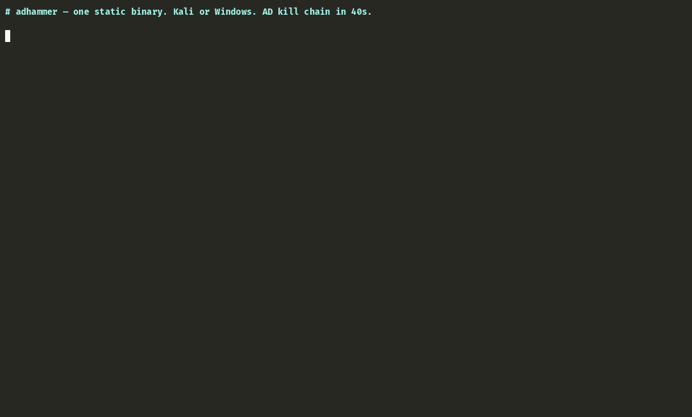
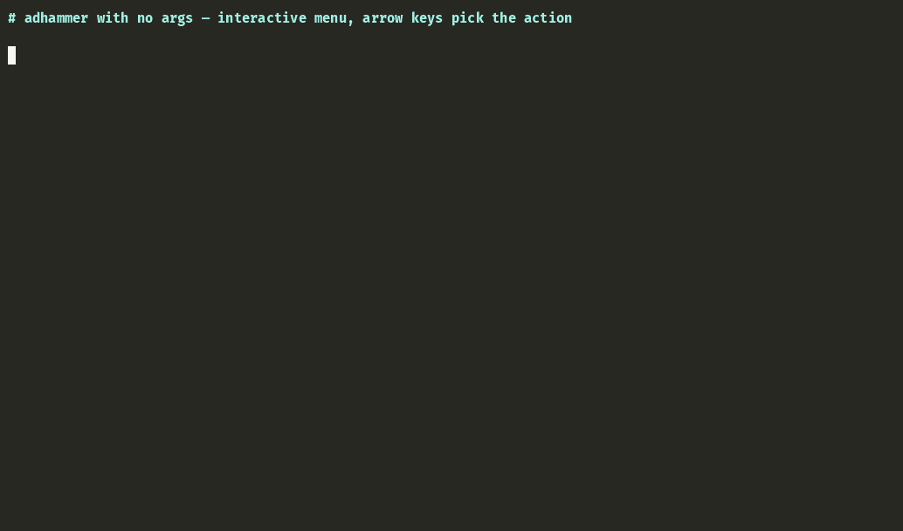

# ADhammer

[](https://github.com/icedracon/adhammer/actions/workflows/ci.yml)
[](https://github.com/icedracon/adhammer/releases)
[](https://crates.io/crates/adhammer)
[](LICENSE)

An **Active Directory security-assessment** toolkit in Rust: a PingCastle-class auditor that maps
a domain's attack paths — scored, graphed, and MITRE-tagged — then, for authorized red-team and
research use, **proves** those paths end-to-end. One static binary, from Kali/Linux or Windows, on
an embedded from-scratch DCE/RPC · NTLM · SMB2 · Kerberos stack (the "impacket for Rust" that
didn't otherwise exist).

Built as security research (ITMO); sibling to a Windows kernel 0-day disclosed to Microsoft MSRC.
For **authorized engagements, red-team validation, and education** only.

> **Authorized use only.** The validation modules implement working offensive techniques (DCSync,
> golden/silver tickets, pass-the-ticket, NTLM relay, ADCS abuse, RCE). Use ADhammer only against
> systems you own or are explicitly authorized to test. See [SECURITY.md](SECURITY.md).

📝 **Write-up:** [I built a full AD pentest + audit tool in Rust — on a protocol stack I wrote from scratch (no impacket)](https://dev.to/pumadracon/i-built-a-full-active-directory-pentest-audit-tool-in-rust-on-a-protocol-stack-i-wrote-from-fl5)

## How it works

**1 — Audit.** ADhammer collects a domain over LDAP as a low-privileged user (via the `SD_FLAGS`
control), builds a BloodHound-style control-path graph in-process, and runs **33 checks** across
the four PingCastle categories — including **10 of the 16 AD CS ESC classes**, ADIDNS exposure,
and SYSVOL/GPP — scoring and MITRE-tagging every finding, exportable to BloodHound.

**2 — Validate.** A report shouldn't say a path *might* be exploitable. On its native protocol
stack ADhammer implements the matching tradecraft — Kerberos roasting, coercion, RBCD, Shadow
Credentials, DCSync, golden/silver tickets, pass-the-ticket, LAPS read, WinRM/SVCCTL exec, ADCS
enrollment — each **live-validated against a fully-patched Windows Server 2025 DC**.



*A single Rust binary on Kali: DCSync the krbtgt key → forge a golden ticket → pass-the-ticket over SMB → code execution as `NT AUTHORITY\SYSTEM` on a fully-patched Server 2025 DC.*

## Why ADhammer

|                       | **ADhammer**                          | PingCastle          | impacket / Rubeus          |
|-----------------------|---------------------------------------|---------------------|----------------------------|
| Language              | Rust — one static binary              | C# (.NET)           | Python / C#                |
| Runs from             | Kali/Linux **and** Windows            | Windows only        | Linux (impacket) / Windows |
| Passive AD audit      | ✅ 33 checks + control-path graph      | ✅ (the reference)   | ❌                          |
| Validation / offense  | ✅ roast·DCSync·tickets·relay·RCE      | ❌ (audit only)      | ✅ (offense only)           |
| Protocol stack        | from-scratch, no impacket dependency  | .NET libs           | mature, batteries-included |
| Runtime               | none (pure-Rust crates)               | .NET runtime        | Python runtime             |
| Live-validated on     | **Windows Server 2025** (patched) **+ Server 2022** | broad     | broad                      |

The niche: **audit and validation in one Linux-native binary**, on a self-rolled stack whose
security-descriptor parser and RPC/NTLM/SMB layer are reusable Rust crates that didn't previously
exist ([`windows-sddl`](https://crates.io/crates/windows-sddl),
[`ntlmssp`](https://crates.io/crates/ntlmssp),
[`smb2-client`](https://crates.io/crates/smb2-client),
[`dcerpc`](https://crates.io/crates/dcerpc)).

## Install

```sh
cargo install adhammer
```

On Debian/Kali, install the build deps first (the LDAP layer links system TLS):

```sh
sudo apt-get install -y build-essential pkg-config libssl-dev
```

Or grab a prebuilt binary from [Releases](https://github.com/icedracon/adhammer/releases), or build
from source (`git clone … && cargo build --release`). Requires Rust 1.80+.

## Usage

Run `adhammer` with no arguments for the **guided interactive menu**: it asks for user → password
(or NT hash) → domain → DC, saves the session, then walks every action with prompts. For
golden/silver/pass-the-ticket it **auto-fetches** the krbtgt/service AES256 key (via DCSync) and the
domain SID (via LSAT) from your session — no pasting keys or SIDs. Add `--no-save` to keep creds off
disk, or "Wipe saved session" from the menu.



Long-running steps show a live spinner with an elapsed timer; styling auto-disables when output is
piped (so `scan` JSON and logs stay clean — `NO_COLOR` / `CLICOLOR_FORCE` honored).

Power-user subcommands:

```
scan                                        passive audit → JSON/HTML (+ --sysvol, --bloodhound out.zip)
auto                                         guided: scan → confirm each weakness → validate + PoC report
enum   {samr, lsa, net, dns, adcs}          RPC / network / ADIDNS / AD-CS enumeration
attack {roast, spray, abuse, coerce, rbcd, constrained, dcsync, exec, atexec, secretsdump,
        gmsa, laps, esc1, golden, silver, pth, asktgt, winrm, capture, poison, relay}
```

**Guided mode** (`adhammer auto`, or the interactive "Guided" menu): runs the audit, then walks
each finding — colored, severity-coded — asking *"validate and capture a PoC?"*. On yes it runs the
matching attack, and marks the finding **validated only when the real proof is present** (an actual
`$krb5tgs$`/`$krb5asrep$` hash, a replicated `krbtgt` secret, an `ISSUED` cert) — otherwise honestly
"attempted." It also runs opportunistic **active checks** beyond the passive scan (LAPS local-admin
read, AD CS ESC8 web-enrollment probe), adding them only if a weakness is confirmed. Everything —
validated, attempted, declined, and potential — lands in a **Markdown assessment report** with the
exact command + captured evidence per PoC. `--yes` runs it unattended.

Validators: Kerberoast · AS-REP · DCSync · gMSA read · AD CS ESC1 · LAPS read · ESC8 probe.

```sh
# Audit a domain (low-priv creds are enough), export a BloodHound graph:
adhammer scan --url ldaps://dc.corp.local:636 --user 'CORP\svc' --password … --insecure --bloodhound out.zip

# ADIDNS + AD CS recon:
adhammer enum dns  --url ldaps://dc:636 --user 'CORP\svc' --password … --insecure
adhammer enum adcs --url ldaps://dc:636 --user 'CORP\svc' --password … --insecure   # + ESC8 web-enroll probe

# DCSync the krbtgt key, forge a golden ticket, pass-the-ticket to SYSTEM:
adhammer attack dcsync --host dc --domain CORP --user Administrator --password … --target krbtgt
adhammer attack pth    --host dc --realm CORP.LOCAL --krbtgt-aes256 <64-hex> --domain-sid S-1-5-21-… --spn cifs/dc.corp.local --command whoami
```

## Audit coverage

- **Privileged accounts** — AS-REP/Kerberoast exposure, unconstrained delegation, DCSync control
  paths (graph), sensitive-group membership, gMSA read ACL, SID history, RBCD, LAPS coverage,
  PASSWD_NOTREQD.
- **Trusts** — SID filtering, selective auth, cross-forest TGT delegation, RC4, transitivity.
- **Stale objects** — inactive users/computers, old passwords, EOL OS, duplicate SPNs, stale
  machine passwords.
- **Anomalies** — MachineAccountQuota, krbtgt age, RC4 Kerberos, reversible encryption,
  badSuccessor (dMSA), password policy, anonymous LDAP (dSHeuristics), Pre-Windows 2000 Compatible
  Access, Guest, GPP cpassword (MS14-025), and — from GptTmpl.inf — LM/NTLMv1, LDAP/SMB signing.
- **AD CS (10/16 ESC)** — passive: **ESC1, ESC2, ESC3, ESC4, ESC5, ESC9, ESC13, ESC14, ESC15/EKUwu
  (CVE-2024-49019)**; active: **ESC8** web-enrollment probe (`enum adcs`). ESC6/7/10/11/16 read the
  CA/DC registry and are out of current scope.
- **ADIDNS** — zone/record enumeration with wildcard (mitm6/WPAD) detection (`enum dns`).

Every finding carries a MITRE ATT&CK technique (T1558.003 Kerberoasting, T1003.006 DCSync, T1649
cert abuse, T1484 policy/trust modification, …).

## Validated capabilities

Every audit finding is backed by a working technique, so a red team can confirm impact and a
defender can see exactly what the misconfiguration yields. All live-validated end-to-end against a
hardened **Server 2025** DC — and, to prove the Linux-native positioning, built on Kali and run
against the DC.

- **Recon / export** — `scan` (33 checks + graph as a low-priv user), `enum samr` / `enum lsa`,
  `enum net` (host/AD-port/SMB-signing sweep), `enum dns` (ADIDNS), `enum adcs` (CAs + ESC8),
  `enum esc` (ESC6/10/11/16 over MS-RRP), `scan --bloodhound` (SharpHound-compatible zip).
- **Credential access** — **DCSync** single-object and full-domain (NT hashes + Kerberos keys incl.
  RFC 8009 AES-SHA2), **gMSA** and **LAPS** read over LDAPS, offline **secretsdump** (hand-rolled
  `regf` hive parser → bootkey → SAM/LSA/DCC2), **pass-the-hash**, **overpass-the-hash** (RC4→TGT).
- **Kerberos** — AS-REP + Kerberoast (RC4/AES), **RBCD** (S4U2Self→S4U2Proxy), **Shadow Credentials**
  PKINIT (incl. Server 2025 `paChecksum2` that breaks Rubeus/PKINITtools), **golden / silver
  tickets** with a from-scratch PAC (accepted by a patched 2025 KDC, KB5020805), **pass-the-ticket**
  over SMB.
- **Lateral / exec** — **SVCCTL** (psexec-style, LocalSystem, C$ output), **WinRM** (WS-Man + NTLM
  message encryption, no service-install event), **TSCH** (`atexec`).
- **ADCS** — **ESC1** enrollment (spoofed-UPN SAN over MS-ICPR) → client-auth cert as the target,
  and **ESC6/10/11/16** decided from the CA/DC registry over **MS-RRP** (`enum esc`, the checks
  LDAP can't see).
- **Coercion / relay** — PetitPotam / PrinterBug, LLMNR/NBT-NS poisoning, SMB→LDAP NTLM relay
  (writes a Shadow Credential).

See **[VECTORS.md](VECTORS.md)** for the full closed / partial / open matrix and
**[ROADMAP.md](ROADMAP.md)** for what's next.

## Architecture

The protocol stack ships as standalone, published crates — this repo consumes them (the dogfooding
proof, and the reusable "impacket for Rust"):

| Published crate | Role |
|-----------------|------|
| [`windows-sddl`](https://crates.io/crates/windows-sddl) | no-FFI `SECURITY_DESCRIPTOR`/DACL/ACE parser (MS-DTYP) + `Sid`/`Guid` + AD extended-right GUIDs |
| [`ntlmssp`](https://crates.io/crates/ntlmssp) | NTLMSSP (NTLMv2, MIC, key-exch) + RC4 sign+seal for RPC packet privacy |
| [`smb2-client`](https://crates.io/crates/smb2-client) | async SMB2 client (negotiate → NTLMv2 SPNEGO → IPC$/named pipe; signing; file I/O) |
| [`dcerpc`](https://crates.io/crates/dcerpc) | NDR · PDUs · sign+seal · TCP/SMB transports · EPM · SAMR · LSAT · DRSUAPI · SVCCTL · TSCH · EFSR · RPRN · ICPR · DCOM (OXID resolver) |

Workspace crates (audit + orchestration): `core` (model + MITRE), `graph` (control-path,
reverse-Dijkstra to Tier-0), `collector` (LDAP over domain + Configuration NC), `checks` (the
33-rule engine), `kerberos` (roast · S4U/RBCD · Shadow-Cred PKINIT · golden/silver · pass-the-ticket),
`sysvol` (GPP/GptTmpl), `report` (risk scoring → JSON/HTML), `ldap` (hand-rolled BER + NTLM SASL for
the relay bridge), `bloodhound` (SharpHound export), `secrets` (offline hive/SAM decryption).

## Test

```sh
cargo test --workspace     # hermetic unit tests (no network)
```

Unit tests cover every parser, crypto primitive, and marshaler against spec vectors and round-trips
(NTOWFv2, RC4/RFC 6229, GPP AES key, NDR alignment, RPC PDUs, EPM towers, SMB2 signing, SAMR/LSAT,
PKINIT DH, PAC/DNS-record/LAPS parsing); ~50 more live in the extracted crates. Live-DC integration
tests in `cli/tests/integration.rs` are `#[ignore]`d — run against a lab with
`ADH_DC=… ADH_PASS=… cargo test --test integration -- --ignored --test-threads=1`.

`ldap3` links platform TLS (native-tls) so LDAPS works against legacy DCs whose handshake still uses
SHA-1 — which rustls refuses.

## Status & caveats

- All parsing, crypto, and marshaling are unit-tested; the audit and validated flows above are
  live-validated against **Server 2025 and Server 2022** lab DCs. On 2022, 22 flows were run
  end-to-end — `scan`/`auto`, `enum` (`samr`/`lsa`/`net`/`dns`/`adcs`/`esc`), `roast` (RC4+AES) /
  `spray` / `dcsync --all`, `exec` (SVCCTL→SYSTEM) / `winrm` / `pth`, `golden` (KDC-accepted) /
  `silver` / `asktgt`, `secretsdump`, `abuse` (add-spn/set-password/add-member/write-rbcd), `coerce`
  (PrinterBug), and **ESC1** (low-priv → Administrator cert → PKINIT TGT). The 2016/2019/2012R2
  matrix is on the roadmap.
- `attack capture`/`relay`/`poison` need a Linux attacker host (a Windows host holds TCP/445), which
  is the Kali-native positioning; `attack atexec` (TSCH) is a redundant RCE method that still
  faults `nca_s_fault_ndr` on modern targets — use `exec` (SVCCTL) or `winrm`.
- Default LDAP binds use LDAPS (`--insecure` for a lab self-signed cert; a bare username is
  auto-qualified to a UPN). Plaintext simple bind is refused by hardened DCs; SASL GSSAPI is an
  off-by-default cargo feature.
- Out of current scope: AD CS **ESC7** (CA Security-SD parse over RRP), and WMI exec (the DCOM/OXID
  foundation exists in `dcerpc`; the activation chain is not yet wired). ESC6/10/11/16 are now
  covered by `enum esc`.

Authorized research / academic / authorized-engagement use only — see [SECURITY.md](SECURITY.md).
