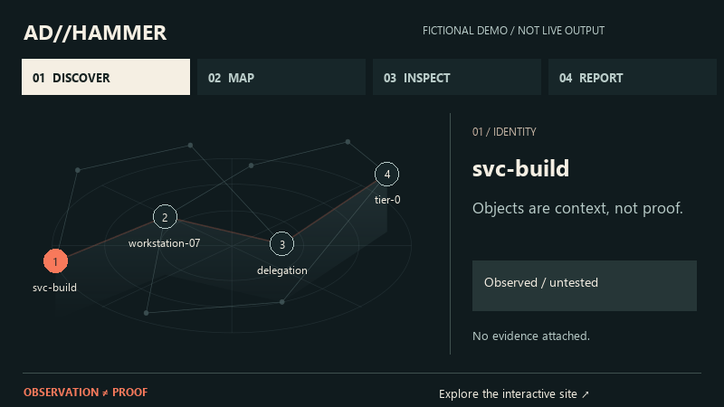

<p align="center">
  
</p>

<p align="center">
  <a href="https://icedracon.github.io/adhammer/"><strong>Explore the website ↗</strong></a>
  &nbsp; · &nbsp;
  <a href="#quick-start">Quick start</a>
  &nbsp; · &nbsp;
  <a href="#10-useful-starting-commands">10 commands</a>
  &nbsp; · &nbsp;
  <a href="docs/VALIDATION.md">Validation ledger</a>
  &nbsp; · &nbsp;
  <a href="https://docs.rs/adhammer-sdk">SDK docs</a>
</p>

<p align="center">
  <a href="https://github.com/icedracon/adhammer/actions/workflows/ci.yml"></a>
  <a href="https://crates.io/crates/adhammer"></a>
  <a href="LICENSE"></a>
</p>

## Understand the directory. Keep the proof.

**ADhammer is an open-source Active Directory security assessment and
pentesting tool written in Rust.** It collects directory state, models
control paths toward Tier-0, and produces structured reports for authorized
assessments.

The distinction matters: **an observed condition or possible path is not a
validated result.** Support, evidence, and outstanding validation belong in
the [validation ledger](docs/VALIDATION.md), not in a marketing score.

## Quick start

Install the CLI and inspect its help:

```sh
cargo install --locked adhammer
adhammer --help
```

Prefer a binary? [GitHub Releases](https://github.com/icedracon/adhammer/releases)
provides Linux, macOS, and Windows downloads, checksum sidecars, and
verification instructions. No Python runtime or sidecar service is required.

> [!CAUTION]
> Use ADhammer only on systems you own or are explicitly authorized to test.
> Some assessment and validation capabilities can affect production systems.
> Read the [security policy](SECURITY.md) and [capability boundaries](docs/VALIDATION.md)
> before use.

## 10 useful starting commands

A practical starting set for **v1.5.1**, not a usage ranking. Expand a command
to see what it does and what to expect. Installation contacts crates.io;
only **05–06** below probe a directory environment. The other commands stay local.

<details>
<summary><strong>01 / Install the documented version</strong></summary>

```sh
cargo install --locked adhammer@1.5.1
```

Builds and installs the CLI using Cargo. Requires a compatible Rust toolchain
and registry access; use the release binaries above if you do not want to build.

</details>

<details>
<summary><strong>02 / Check which version is running</strong></summary>

```sh
adhammer --version
```

For this release, the output is `adhammer 1.5.1`. If it differs, check which
executable your shell resolves before following version-specific documentation.

</details>

<details>
<summary><strong>03 / Explore the command tree</strong></summary>

```sh
adhammer --help
```

Lists the available command groups and global options. Printing help does not
start an assessment. Use a subcommand's own `--help` for its accepted arguments.

</details>

<details>
<summary><strong>04 / Understand diagnostic options</strong></summary>

```sh
adhammer doctor --help
```

Shows the diagnostic flags, including `--domain`, `--dc`, `--timeout`, and
`--json`. The domain-controller flag is **`--dc`**, not `--dc-ip`.

</details>

<details>
<summary><strong>05 / Check DNS and connectivity in your authorized environment</strong></summary>

```sh
adhammer doctor --domain corp.example --dc 192.0.2.10 --timeout 3
```

`corp.example` and `192.0.2.10` are documentation placeholders: replace them
only with your approved environment's values. This performs DNS discovery and
TCP reachability checks; it is **not offline**. No credentials are supplied here,
so an authenticated LDAP bind is not tested. The timeout applies per probe,
not to the total run.

Expect a diagnostic checklist and a verdict. A reachable port does not establish
that authentication works or that an assessment capability is validated.

</details>

<details>
<summary><strong>06 / Request machine-readable diagnostics</strong></summary>

```sh
adhammer doctor --domain corp.example --dc 192.0.2.10 --timeout 3 --json
```

Runs the same network diagnostics as 05, but emits JSON containing checks and
a verdict. Use it for your own approved diagnostic workflow. Inspect the actual
result rather than assuming every check passed; scrub identifiers before sharing it.

</details>

<details>
<summary><strong>07 / Read the scan interface before using it</strong></summary>

```sh
adhammer scan --help
```

Prints collection and report options without connecting to a domain. Review
the flags and the [validation ledger](docs/VALIDATION.md) before choosing a
scoped assessment; this example does not initiate one.

</details>

<details>
<summary><strong>08 / Generate Bash completion text</strong></summary>

```sh
adhammer completions bash
```

Prints a Bash completion script to standard output. It does not install or
activate it; review it and follow your shell's normal completion setup.

</details>

<details>
<summary><strong>09 / Generate PowerShell completion text</strong></summary>

```powershell
adhammer completions powershell
```

Prints the PowerShell completion script. Your profile remains unchanged;
generation alone does not enable tab completion in the current session.

</details>

<details>
<summary><strong>10 / Generate the local manual</strong></summary>

```sh
adhammer man
```

Prints the manual in **roff source format**, not a rendered terminal page.
It does not install a system manual or change your machine's configuration.

</details>

The network examples above illustrate syntax and expected behavior, not captured
assessment results. They were not run against a live domain for this README.

## A workflow with an evidence trail

<p align="center">
  <a href="https://icedracon.github.io/adhammer/#engine"></a>
</p>

*Animated schematic, not a screen recording or real assessment. Plays once.*
[Open the interactive Observatory](https://icedracon.github.io/adhammer/#engine) ·
[Static preview](docs/observatory-preview.png)

| Stage | Purpose |
|:--|:--|
| **01 / Discover** | Collect directory objects and posture within the agreed scope. |
| **02 / Map** | Analyze relationships and shortest-cost control paths to Tier-0. |
| **03 / Validate** | Distinguish observations from proof; consult the ledger before relying on a capability. |
| **04 / Report** | Review findings through JSON, HTML, Markdown, or BloodHound CE export. |

[Explore the visual walkthrough ↗](https://icedracon.github.io/adhammer/#engine)

## Version 1.5.1

**Operator experience and reliability.** Available on
[GitHub](https://github.com/icedracon/adhammer/releases/tag/v1.5.1) and
[crates.io](https://crates.io/crates/adhammer/1.5.1).

- Credential-reference handling fixes.
- Clearer diagnostic preflight and CLI guidance.
- Cleaner JSON output and inconclusive results when no checks ran.
- More explicit partial and scaffolding markers.

This is a summary, not a blanket validation claim.
[Read the complete changelog](CHANGELOG.md#151--2026-09-11).

## Know what you can rely on

The ledger assigns each capability one of four tiers:

| Tier | Boundary |
|:--|:--|
| **Supported** | Recorded support and evidence under the ledger's contract; check the row for environment coverage and remaining receipts. |
| **Experimental** | Behind a non-default feature; experimental, not a general support promise. |
| **Offline-only** | Offline preflight / wire dry-run evidence, not live-target proof for the current release cycle. |
| **Validation owed** | Not yet validated; code presence does not establish readiness. |

The [ledger](docs/VALIDATION.md) is authoritative. Publication, a passing build,
or a diagram does not by itself prove end-to-end behavior.

### Scope and boundaries

ADhammer focuses on **Active Directory assessment and reporting**.
Its JSON output can feed approved downstream workflows; it is **not a
built-in SIEM connector**. EDR and DLP remain external controls. Sigma / YARA
rule engines, general web-application scanning, and Android / APK testing
are not shipped as ADhammer capabilities.

## Build with the Rust ecosystem

Use the [SDK](https://docs.rs/adhammer-sdk) for the application-level interface,
or select a focused library. Every crate has its own scope and maturity;
publication alone does not establish production readiness.

| Layer | Libraries |
|:--|:--|
| **Directory & graph** | [adhammer-collector](https://crates.io/crates/adhammer-collector) · [adhammer-graph](https://crates.io/crates/adhammer-graph) · [adhammer-bloodhound](https://crates.io/crates/adhammer-bloodhound) |
| **Transport & representation** | [dcerpc](https://crates.io/crates/dcerpc) · [smb2-client](https://crates.io/crates/smb2-client) · [ms-ndr](https://crates.io/crates/ms-ndr) |
| **Identity & protected data** | [adhammer-kerberos](https://crates.io/crates/adhammer-kerberos) · [ntlmssp](https://crates.io/crates/ntlmssp) · [dpapi-ng](https://crates.io/crates/dpapi-ng) |

## Documentation

- [Command reference](VECTORS.md) — inventory and documented syntax.
- [Validation ledger](docs/VALIDATION.md) — support, evidence, and outstanding work.
- [Changelog](CHANGELOG.md) — release-specific changes and limitations.
- [Benchmarks](docs/BENCHMARKS.md) — methodology and recorded data.
- [Contributing](CONTRIBUTING.md) · [Security policy](SECURITY.md) · [MIT license](LICENSE).

---

<p align="center">
  Built by <a href="https://github.com/icedracon"><strong>icedracon</strong></a>
  &nbsp; / &nbsp; Evidence before conclusions.
</p>
