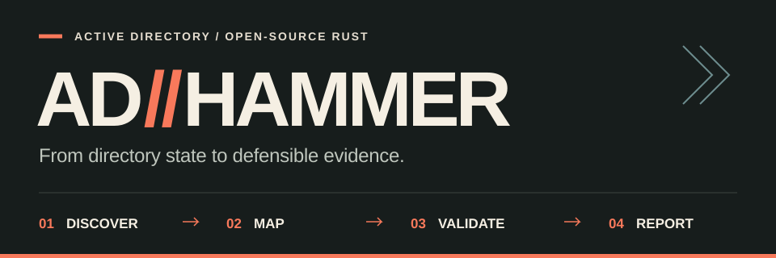

<p align="center">
  
</p>

<h1 align="center">ADhammer</h1>

<p align="center">
  <strong>Evidence-first Active Directory security assessment in one Rust binary.</strong><br />
  Discover the estate. Map paths to Tier-0. Validate supported findings. Ship defensible evidence.
</p>

<p align="center">
  <a href="https://icedracon.github.io/adhammer/"><strong>Website</strong></a>
  &nbsp;·&nbsp;
  <a href="#install"><strong>Install</strong></a>
  &nbsp;·&nbsp;
  <a href="#capability-map"><strong>Capabilities</strong></a>
  &nbsp;·&nbsp;
  <a href="docs/VALIDATION.md"><strong>Validation ledger</strong></a>
  &nbsp;·&nbsp;
  <a href="https://docs.rs/adhammer-sdk"><strong>Rust SDK</strong></a>
</p>

<p align="center">
  <a href="https://github.com/icedracon/adhammer/actions/workflows/ci.yml"></a>
  <a href="https://github.com/icedracon/adhammer/releases"></a>
  <a href="https://crates.io/crates/adhammer"></a>
  <a href="docs/POLICY_MSRV.md"></a>
  <a href="LICENSE"></a>
</p>

---

ADhammer is an open-source CLI for **authorized Active Directory assessments**.
It brings collection, graph analysis, supported validation, and multi-format
reporting into a single workflow while keeping a strict line between a signal
and something actually proven.

<table>
  <tr>
    <td width="50%" valign="top">
      <h3>Scope-aware discovery</h3>
      <p>Start without credentials using bounded DNS SRV discovery, AD-facing web fingerprints, and anonymous SMB posture checks. Explicit includes and excludes keep first-touch work inside the declared scope.</p>
    </td>
    <td width="50%" valign="top">
      <h3>Tier-0 path analysis</h3>
      <p>Turn collected directory state into directional control edges, ranked findings, and the lowest-cost paths to Tier-0—with a mitigation attached to every reported hop.</p>
    </td>
  </tr>
  <tr>
    <td width="50%" valign="top">
      <h3>Proof, not implied impact</h3>
      <p>Every capability is tracked as supported, experimental, offline-only, or validation owed. Reports preserve that state instead of presenting possible paths as completed compromise.</p>
    </td>
    <td width="50%" valign="top">
      <h3>Native Rust protocol stack</h3>
      <p>LDAP, Kerberos, SMB2, NTLM, DCE/RPC, AD CS, SYSVOL, and BloodHound CE integration sit behind one portable CLI—without a Python runtime or sidecar service.</p>
    </td>
  </tr>
</table>

## One workflow, evidence at every stage

<p align="center">
  
</p>

```text
authorized scope
      │
      ▼
discover ──► collect ──► control graph ──► scored checks
                                              │
                                              ▼
                                    supported validation
                                              │
                                              ▼
                              JSON · HTML · Markdown · BHCE
```

- **Discover** domain controllers and exposed AD services without silently expanding scope.
- **Collect** directory, trust, delegation, AD CS, host-posture, and optional SYSVOL state.
- **Map** control relationships and rank viable routes to Tier-0.
- **Validate** only supported paths, with operator consent and recorded proof.
- **Report** findings, paths, mitigations, and evidence in reviewable formats.

## Quick start

Install the binary, inspect the command surface, then start with a declared
authorized scope.

```sh
cargo install --locked adhammer
adhammer --help
```

### No-credential first touch

```sh
adhammer run \
  --domain corp.example \
  --range 10.20.0.0/24 \
  --dns-server 10.20.0.10 \
  --web
```

### Authenticated assessment and report bundle

```sh
adhammer scan \
  --url ldaps://dc01.corp.example:636 \
  --user assessor \
  --password @file:/secure/path/password.txt \
  --out-all assessment
```

That single scan writes JSON, HTML, Markdown, and a plaintext executive
summary. Use `--out domain.zip` when you need a BloodHound CE v5 ingest bundle.

> [!TIP]
> Run `adhammer <command> --help` before a live operation. Password arguments
> accept `@file:/path/to/secret` and `$ADHAMMER_PASSWORD`, so credentials do
> not need to be placed directly on the command line.

## Capability map

The table below is a readable overview—not a substitute for the
[authoritative validation ledger](docs/VALIDATION.md).

| Area | Operator surface | What ADhammer provides |
|:--|:--|:--|
| **Assessment** | `scan`, `auto` | LDAP collection, scored checks, Tier-0 control paths, baseline diffs, and guided supported validation. |
| **First touch** | `run`, `scan --anonymous` | Scope-filtered DNS discovery, AD web-surface fingerprints, and anonymous host posture. |
| **Enumeration** | `enum` | SAMR, LSAT, ADIDNS, AD CS, DC posture, sessions, logged-on users, SCCM/SCOM, Kerberos users, shares, and SYSVOL. |
| **Kerberos** | `attack roast`, `asktgt`, `ptt`, `rbcd`, `constrained`, `golden`, `silver`, `diamond`, `unpac` | Roast workflows, ticket acquisition and use, delegation paths, ticket forging, and PKINIT credential recovery. |
| **AD CS** | `check adcs`, `enum adcs`, `enum esc`, `attack esc1`, `attack esc4`, `attack shadowcred` | Certificate-template analysis, registry-backed ESC posture, and supported certificate abuse paths. |
| **Coercion and relay** | `attack coerce`, `capture`, `poison`, `relay` | Supported coercion families, NetNTLMv2 capture, LLMNR/NBT-NS lure, and validated LDAP relay targets. |
| **Replication and execution** | `attack dcsync`, `dcshadow`, `exec`, `atexec`, `wmiexec`, `winrm` | Single-object replication, supported DCShadow stages, and multiple post-auth execution transports. |
| **Secrets** | `attack secretsdump`, `gmsa`, `laps`, `lsa`, `dpapi-master-key`; `dump laps`, `dump gmsa` | Authorized retrieval and offline handling with redaction-aware output boundaries. |
| **Evidence and integrations** | `--out`, `--out-all`, `--json`, `--text` | JSON envelopes, HTML/Markdown reports, plaintext summaries, report fingerprints, and BloodHound CE export. |
| **Pivots** | global `--socks` | SOCKS5 routing for supported outbound TCP workflows with proxy-side DNS. |

Some implemented paths remain **offline-only** or **validation owed**, including
the ICPR ESC1 live submission path and specific relay/DCShadow stages. They are
not represented above as fully supported. Check the ledger before an
engagement.

## CLI at a glance

```text
adhammer
├── run       no-credential, scope-bound discovery
├── scan      collect → graph → checks → report
├── enum      read-only protocol and directory enumeration
├── check     focused offline or single-taxonomy checks
├── attack    consent-gated validation and operator workflows
├── dump      focused LAPS and gMSA retrieval
├── auto      scan → supported validation → report bundle
└── setup     one-shot environment helpers
```

`attack`, `enum`, and `dump` emit a structured JSON envelope by default. Use
`--text` for human-readable terminal output, or stack `-v`, `-vv`, and `-vvv`
for progressively deeper diagnostics without logging key bytes, ticket
contents, or hashes.

## The evidence contract

ADhammer treats validation state as a product boundary:

| State | Meaning |
|:--|:--|
| **Supported** | Default-build capability with automated coverage and current authorized live evidence. |
| **Experimental** | Opt-in feature with CI coverage; not part of the default release surface. |
| **Offline-only** | Tested locally or against known-answer data, but no current live-target proof is recorded. |
| **Validation owed** | Code exists, but sufficient proof is not yet on file. |

The [validation ledger](docs/VALIDATION.md) is checked by CI against public
claims. Implementation alone never upgrades a capability to “supported.”

## Reports built for handoff

A useful finding needs more than a severity label. ADhammer connects:

- the observed condition and affected object;
- its control-path position and route to Tier-0;
- the validation state and available proof;
- a concrete mitigation for each path hop;
- stable JSON for downstream case, scoring, or detection workflows;
- a SHA-256 report fingerprint for evidence integrity.

Use the HTML report for review, JSON for automation, Markdown for engagement
notes, plaintext for the executive summary, and BloodHound CE export for graph
exploration.

## Install

### Prebuilt binaries

Signed release assets are available for Linux, macOS, and Windows on
[GitHub Releases](https://github.com/icedracon/adhammer/releases). Releases
include SHA-256 sidecars and GitHub OIDC Sigstore verification instructions.

### cargo-binstall

```sh
cargo binstall adhammer
```

### Cargo

```sh
cargo install --locked adhammer
```

### From source

```sh
git clone https://github.com/icedracon/adhammer.git
cd adhammer
cargo build --release --locked
```

The minimum supported Rust version is documented in
[docs/POLICY_MSRV.md](docs/POLICY_MSRV.md). The default TLS backend bundles
Rustls/AWS-LC; optional native TLS and GSSAPI builds are documented in the
workspace manifests.

## Built as an ecosystem

ADhammer is the application layer over standalone Rust crates for Microsoft
security protocols. Use the CLI for an assessment or adopt the narrowest crate
for your own tooling.

| Layer | Crates |
|:--|:--|
| **Application** | [`adhammer-sdk`](https://docs.rs/adhammer-sdk) · `adhammer-collector` · `adhammer-checks` · `adhammer-graph` · `adhammer-report` |
| **Directory and export** | `adhammer-ldap` · `adhammer-sysvol` · `bloodhound-export` · `windows-sddl` · `ad-acl` |
| **Authentication** | `adhammer-kerberos` · `ntlmssp` · `ms-pac-forge` · `dpapi-ng` · `dpapi-offline` |
| **Wire protocols** | `smb2-client` · `dcerpc` · `ms-ndr` · `ms-crtd` · `ms-icpr` · `ms-drsr` |

Each crate has its own maturity and validation status. Publication on
crates.io does not by itself imply production readiness.

## Engineering confidence

- Cross-platform build and test jobs for Linux, macOS, and Windows.
- Formatting and Clippy warnings enforced in CI.
- Minimum-Rust-version and package-inventory gates.
- Dependency license, source, and duplicate-version policy via `cargo-deny`.
- Short fuzz campaigns on parser-facing targets plus scheduled longer runs.
- Reproducible-build, release-signing, and rotation documentation.
- A public path for [third-party validation](docs/THIRD_PARTY_VALIDATION.md).

Benchmark claims include their harness, raw rendered data, environment, and
caveats in [docs/BENCHMARKS.md](docs/BENCHMARKS.md).

## Documentation

| If you need… | Read… |
|:--|:--|
| Exact support and proof status | [Validation ledger](docs/VALIDATION.md) |
| Complete vector inventory | [Vector coverage](VECTORS.md) |
| Architecture and trust boundaries | [Architecture](docs/ARCHITECTURE.md) |
| Benchmark methodology and results | [Benchmarks](docs/BENCHMARKS.md) |
| Public API and MSRV expectations | [Stability](docs/STABILITY.md) · [MSRV policy](docs/POLICY_MSRV.md) |
| Reproducing or submitting evidence | [Third-party validation](docs/THIRD_PARTY_VALIDATION.md) |
| Reporting a vulnerability | [Security policy](SECURITY.md) |
| Building or contributing | [Contributing guide](CONTRIBUTING.md) |
| Release history | [Changelog](CHANGELOG.md) |

## Responsible use

> [!CAUTION]
> ADhammer contains active security-assessment capabilities that can affect
> production systems. Use it only on systems you own or have explicit written
> authorization to test. Review the exact command, scope, and validation state
> before execution.

ADhammer creates structured evidence for approved downstream workflows. It is
not a SIEM, EDR, DLP platform, Sigma/YARA rule engine, general web scanner, or
mobile application scanner.

<p align="center">
  <a href="https://github.com/icedracon/adhammer/releases"><strong>Download</strong></a>
  &nbsp;·&nbsp;
  <a href="https://icedracon.github.io/adhammer/"><strong>Explore the site</strong></a>
  &nbsp;·&nbsp;
  <a href="https://github.com/icedracon/adhammer/stargazers"><strong>Star ADhammer</strong></a>
</p>

<p align="center">
  <sub>MIT © <a href="https://github.com/icedracon">icedracon</a></sub>
</p>
